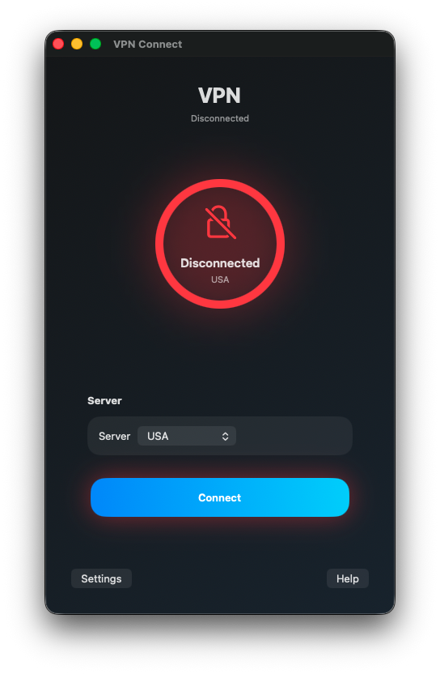
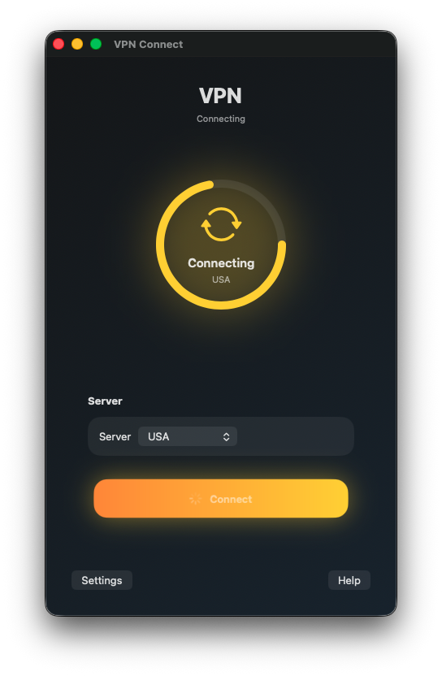
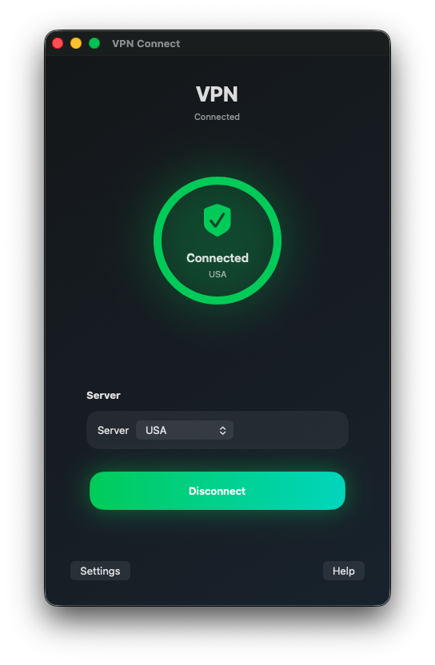

# VPN Connect (SwiftUI)

macOS-приложение VPN

<p align="center">
  
  
  
</p>

---

### Как запустить проект

1. Клонировать репозиторий:
   ```bash
   git clone https://github.com/MrCronkite/VPN
2. Открыть VPN Connect.xcodepro в Xcode 26+
3. Запустить Run (⌘R)

---

### Исправленные UI проблемы
  - Улучшена иерархия элементов (главный фокус — кнопка подключения)
  - Добавлена чёткая обратная связь через состояния (Disconnected -> Connecting -> Connected)
  - Приведён дизайн к единому стилю через централизованные UI-константы

---

### Исправленные UX решения
  - Явные цветовые состояния системы (красный / жёлтый / зелёный)
  - Анимации для отображения процесса подключения
  - Минимизация лишних элементов

